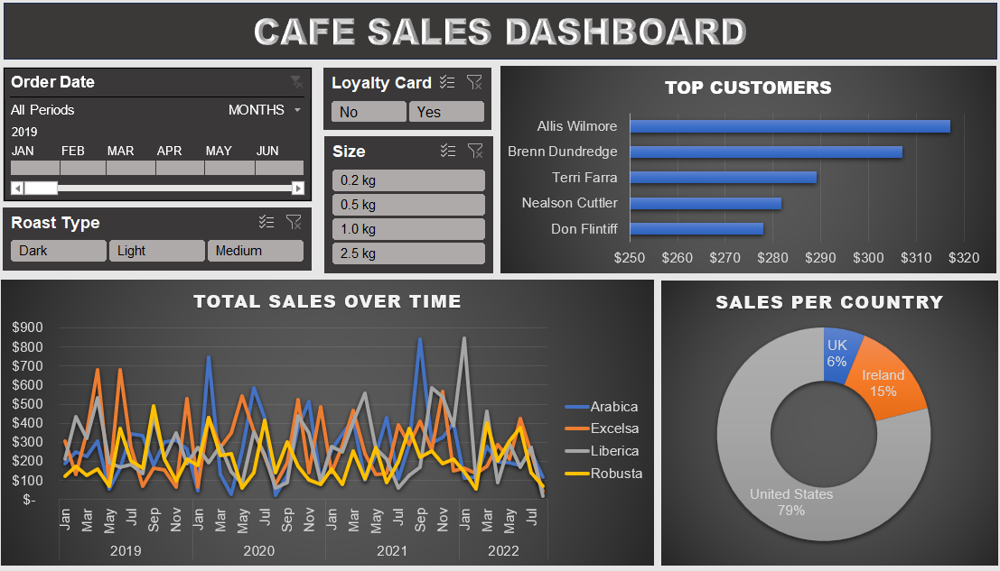

# CAFE SALES DASHBOARD USING EXCEL

## Project Overview
This project involves the creation of a **Cafe Sales Dashboard** using Excel, designed to provide valuable insights into sales performance, and product preferences of the customers to aid decision-making and enhance the cafe's business strategies.

## Dataset Used
The dataset was obtained from Kaggle which includes:
- **Order Details**: Order ID,	Order Date,	Customer ID,	Product ID,	Quantity
- **Customer Information**: Customer ID,	Customer Name,	Email,	Phone Number,	City,	Country,	Postcode,	Loyalty Card
- **Product Attributes**: Product ID,	Coffee Type,	Roast Type,	Size,	Unit Price,	Price per 100g,	Profit

## Key Steps in the Project
1. **Data Cleaning**: Identify and remove duplicates, standardize data accordingly.
2. **Create Working Sheet**: Copy raw data to a working sheet for manipulation, keeping the original data intact.
3. **Pivot Tables**: Utilize pivot tables to summarize and analyze data for visualization.
4. **Visualizations**: Build visualizations using recommended charts to represent key insights.
5. **Chart Customization**: Adjust chart titles, axis labels, and formatting for better clarity.
6. **Dashboard Creation**: Copy visualizations onto a dashboard sheet for a consolidated view.

## Dashboard

## Findings
- Allis Wilmore, followed by Brenn Dundredge contributed the highest to the overall revenue.
- Arabica and Robusta coffees show consistent sales trends with seasonal fluctuations. Arabica appears to be the most popular coffee type.
- Medium and light roast types are gaining more traction compared to dark roast.
- The United States contributes 79% of the sales, making it the dominant market, while Ireland and the UK represent 15% and 6% of the total sales, respectively.
- Sales peak during mid-2019 and early 2020, possibly driven by marketing campaigns or seasonal preferences.
- Sales data indicate that customers with loyalty cards make frequent purchases, emphasizing the importance of loyalty programs in driving revenue.

## Suggestions
- Focus on retaining top customers like Allis Wilmore and Brenn Dundredge by offering personalized deals or exclusive benefits.
- Enhance loyalty programs to attract more frequent purchases from medium-tier customers.
- Introduce promotional offers for less popular roast types, such as dark roast, to diversify customer preferences.
- Run seasonal promotions during high-demand months to capitalize on sales peaks, focusing on popular coffee types like Arabica and Robusta.
- Create limited-edition blends or flavors to attract customers seeking unique products and boost interest in underperforming categories.

## Results
- Arabica and Robusta coffee types dominate the sales, accounting for a major share of revenue.
- Customers from the United States lead the sales volume, followed by Ireland and the UK.
- A robust loyalty program significantly drives customer retention and revenue growth.
